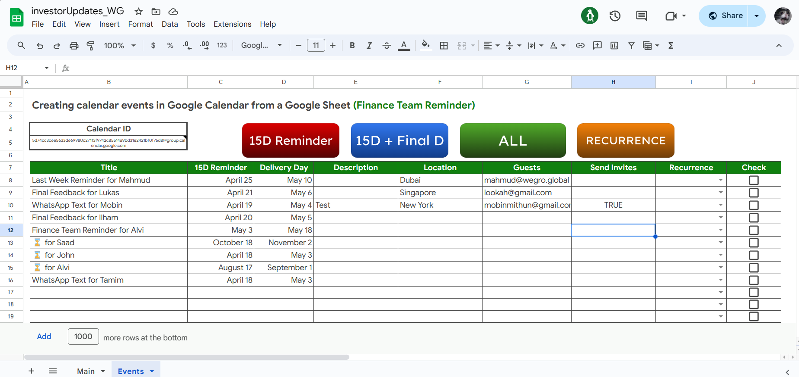

# Google Sheets to Google Calendar Event Scheduling (w/ Google Apps Script)

This project aims to simplify the process of scheduling events in Google Calendar by utilizing Google Sheets as an input interface. With this solution, you can easily manage your events directly from a familiar spreadsheet environment.

## Table of Contents

- [Features](#features)
- [Setup](#setup)
- [Usage](#usage)
- [Options](#options)
- [Contributing](#contributing)
- [Donations](#donations)

## Features

- Integration with Google Sheets: Input your event details conveniently within Google Sheets
- Customizable Event Parameters: Define event details such as title, description, start/end times, and attendees
- Automatic Synchronization: Changes made in the spreadsheet are automatically reflected in Google Calendar
- Easy to Use: Simple setup and intuitive interface for seamless event scheduling

## Setup

1. Open a new [Google Sheet](https://sheets.google.com) or make a copy of [investorUpdates_WG](https://docs.google.com/spreadsheets/d/1GJ3o32q4cvaWIahB7Qqvqh1qXuu1NgZffxmR5Dyg0Qw/edit?usp=drive_link) sheet.
2. Click on `Extensions` > `Apps Script`.
3. Delete the default `Code.gs` file.
4. Click on `File` > `New` > `Script` and name the file `MOB`.
5. Copy the entire script from this [GitHub Repository](https://github.com/MobinMithun/GoogleSheets_EventScheduling_JS/blob/main/apps_script.gs) and paste it into the `MOB.gs` file.
6. Save the script by clicking on the floppy disk icon or pressing `Ctrl + S` (or `Cmd + S` on macOS).
7. Close the Apps Script editor.

## Usage

1. After setting up the script, go back to your Google Sheet.
2. Click on `Events` in the worksheet footer.
3. Add new rows for new events.
4. Paste the `Calendar ID` from your Google Calendar.
5. Click on `ALL` to pull the events from your sheet to the calendar.
   - Click `15D Reminder` to set the event with a start date and time only.
   - Click `15D + Final D` to set the event from a start date to end date.
   - Click `Recurrence` to set the event with a recurring schedule every week..
6. Authorize the script - This is a one time only item.
7. The check boxes will be automatically ticked in `Check` column.

## Options

1. **Calendar ID**: Specifies the calendar to be synced with the Google Sheets document. 
2. **Start Date (15D Reminder)**: Sets the start date for the range of events to be fetched from the Google Calendar. 
3. **End Date (15D + Final D)**: Sets the end date for the range of events to be fetched from the Google Calendar. 
4. **Description**: Sets the details of the events on Google Calendar.
5. **Location**: Sets the location for the events.
6. **Guests**: Sets the mail to connecting users with mailing about the events.
7. **Send Invites**: Ensures mail sending to notify users about the events.

## Limitations

- This script is designed for use with Google Sheets and Google Calendar. It may not work with other spreadsheet or calendar applications.
- The script only supports the synchronization between a single calendar and a single sheet.
- The script may not work as expected if there are too many events or if the calendar has a large number of recurring events.
- The script does not support automated mailing to event attendees or reminders.
- The synchronization process may take some time depending on the number of events and the complexity of the data.

## Contributing

Contributions to this project are welcome! If you have improvements, bug fixes, or new features you'd like to see added, please submit a Pull Request.

## License

This project is licensed under the Apache-2.0 License. See the [LICENSE](https://github.com/MobinMithun/GoogleSheets_EventScheduling_JS/blob/main/LICENSE) file for details.

